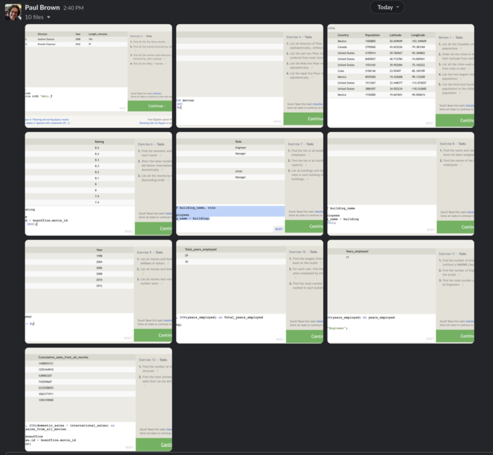
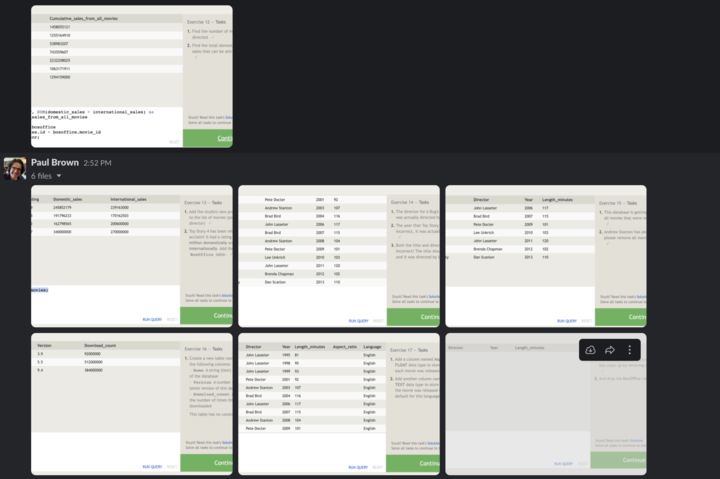

## Overview of SQL

SQL (Structured Query Language), is a programming language used to manage and manipulate databases. You can use it to create, read, update, and delete data in a database. It's like the control center for a database. You can ask questions (queries) like "show me all the users who signed up this month" or "update the email address of user John Doe". It's also used to create and modify the structure of databases, like creating a new table for storing user information. It's a powerful tool that's widely used in many industries, especially where large amounts of data need to be organized and accessed efficiently.

## Homework
I missed screenshotting the first two examples.
Rather than including a ton of screenshots, here's just the screenshot of the screenshots (you should be able to zoom)

